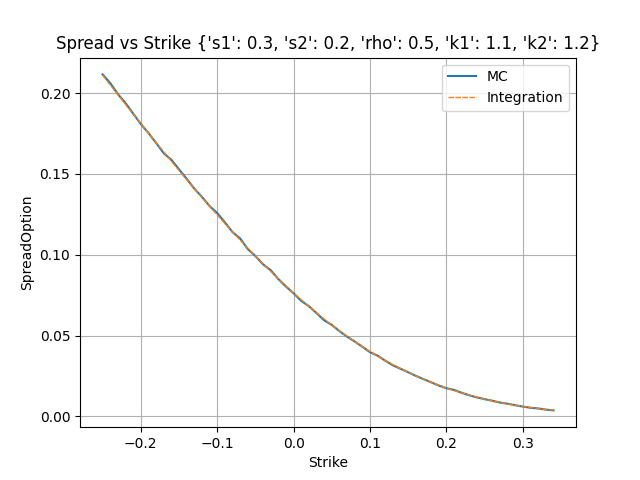
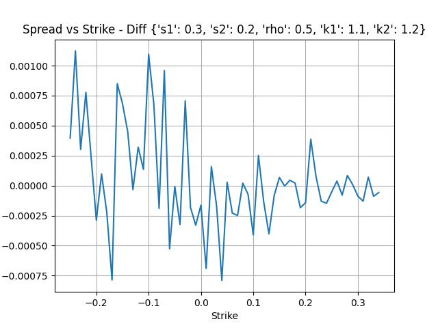

Pricing spread option of 2 assets, with barriers.

Numerical integration (gaussian) on the second dimension, analytical integration on the first dimension.

# Spread Option

$$\left( 
    S_2 - S_1 - k
\right)_+ 
\cdot \mathbb{1}_{\{S_1 < K_1\}}
\cdot \mathbb{1}_{\{S_2 < K_2\}}$$

- stochastic exponential: $f(x, \sigma) = \exp \left( -\frac12 \sigma^2 + \sigma x \right)$
- inverse stochastic exponential: $g(y, \sigma) = \frac{\log(y)}{\sigma} + \frac12 \sigma$

## Correlation

$\rho$ is the correlation between the 2 asset, we decompose the expressions so that we can express formulae with uncorrelated normals.

$z_1,z_2$ are uncorrelated brownians

$$S_1 \sim f(z_1, \sigma_1)$$
$$S_2 \sim f(z_1, \rho\sigma_2) \cdot f(z_2, \sqrt{1-\rho^2} \cdot \sigma_2)$$

## Domains

### Unconditional range of $z_1$

From the barrier on $S_1$
$$z_1 < g(K_1,\sigma_1)$$

From the barrier on $S_2$
$$z_1 < g(K_2 - k,\sigma_1)$$

Range
$$[-\infty, z_{1,\max}=\min(g(K_1,\sigma_1), g(K_2 - k,\sigma_1))]$$

### Conditional range of $z_2$

Lower bound is when spread intrinsic is zero.

$$z_{2,min}=g \left(\frac{f(z_1, \sigma_1) + k}{f(z_1, \rho \sigma_2)}, \sqrt{1-\rho^2} \cdot\sigma_2 \right)$$

Upper bound is the barrier on the $S_2$.
$$z_{2,max}=g \left(\frac{K_2}{f(z_1, \rho \sigma_2)}, \sqrt{1-\rho^2} \cdot\sigma_2 \right)$$

# Analytical integration

For a given $z_1$, we integrate on the distribution of $z_2$.

$$
\begin{align*}
\mathcal{I}(z_1)=&\\
&f(z_1,\rho \sigma_2) \left[
    \Phi \left(z_{2,\max} 
    - \sqrt{1-\rho^2} \cdot \sigma_2\right)
    - \Phi \left(z_{2,\min} 
    - \sqrt{1-\rho^2} \cdot \sigma_2\right)
\right]\\
&-(f(z_1, \sigma_1) + k) \left[
    \Phi \left(z_{2,\max}\right)
    - \Phi \left(z_{2,\min}\right)
\right]
\end{align*}$$

# Numerical Integration

$$\int_{-\infty}^{z_{1,\max}} \mathcal{I}(z_1)\phi(z_1) \mathrm{d} z_1$$

We use gaussian integration on a finite range, choosing lower bound far enough (e.g. $z_{1,\min}=-10$).

# Results

Works great.

